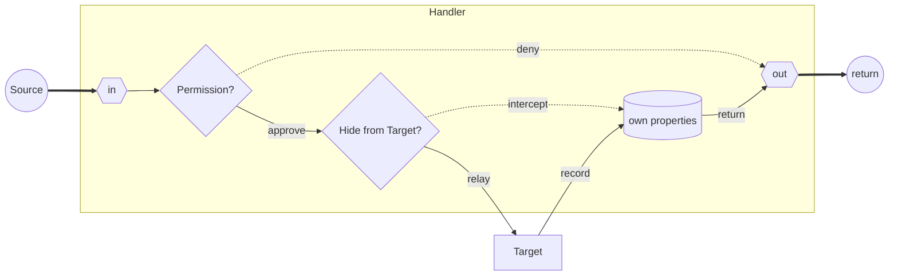
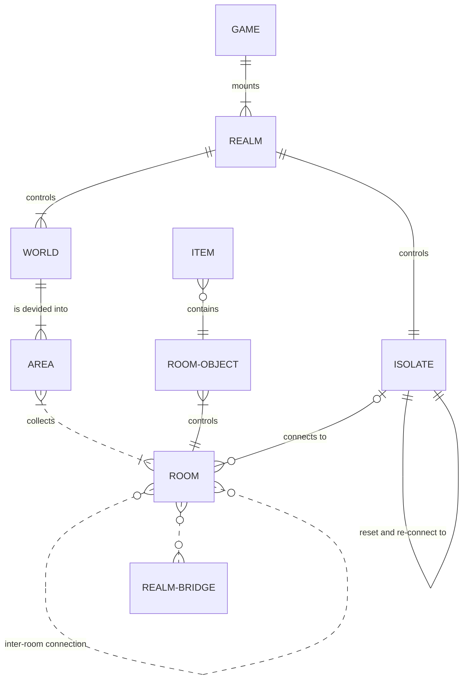

# Class Module

The class module composes the main body of the PoC. Besides offering the base
structure of a game world it also contains some enums (sparsely implemented) and
exports the main game instance (stand-in for a properly configurable one).
But the Focus points are the prototype-inheritance, the Child-Cache module and
the Base-Proxy template.


## Highlights

- [Class Module](#class-module)
  - [Highlights](#highlights)
  - [Class Diagram](#class-diagram)
  - [Base Proxy](#base-proxy)
  - [Child Cache](#child-cache)
  - [Skeleton](#skeleton)
  - [Game Instance](#game-instance)
  - [Enums](#enums)


## Class Diagram

<object type="image/svg+xml" data="/media/mermaid-class-diagram.svg"></object>


## Base Proxy




## Child Cache

```mermaid
{
  "er": {
    "stroke": "#202099",
    "fill": "#ddf"
  }
}
erDiagram
  NODE ||--o| CACHE : "owns"
  CACHE ||..o{ NODE : "stores children"
```


## Skeleton




## Game Instance


## Enums
