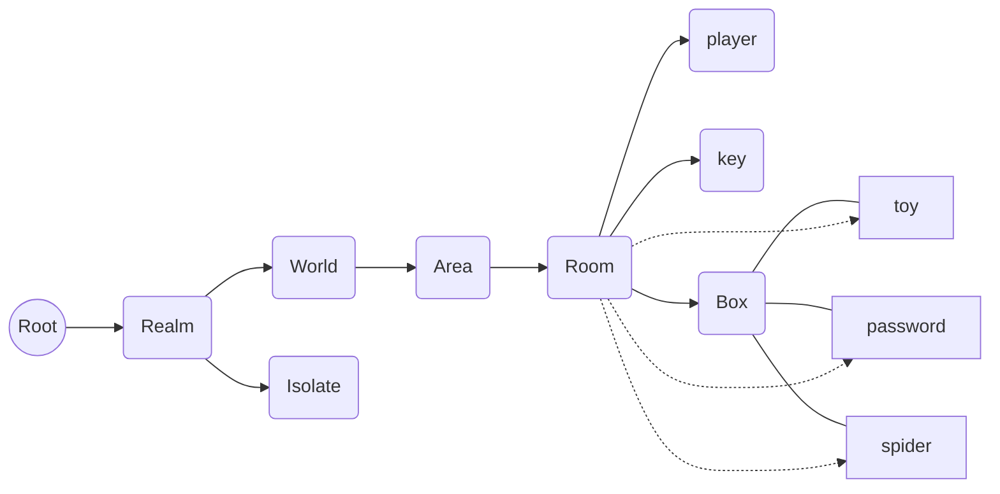
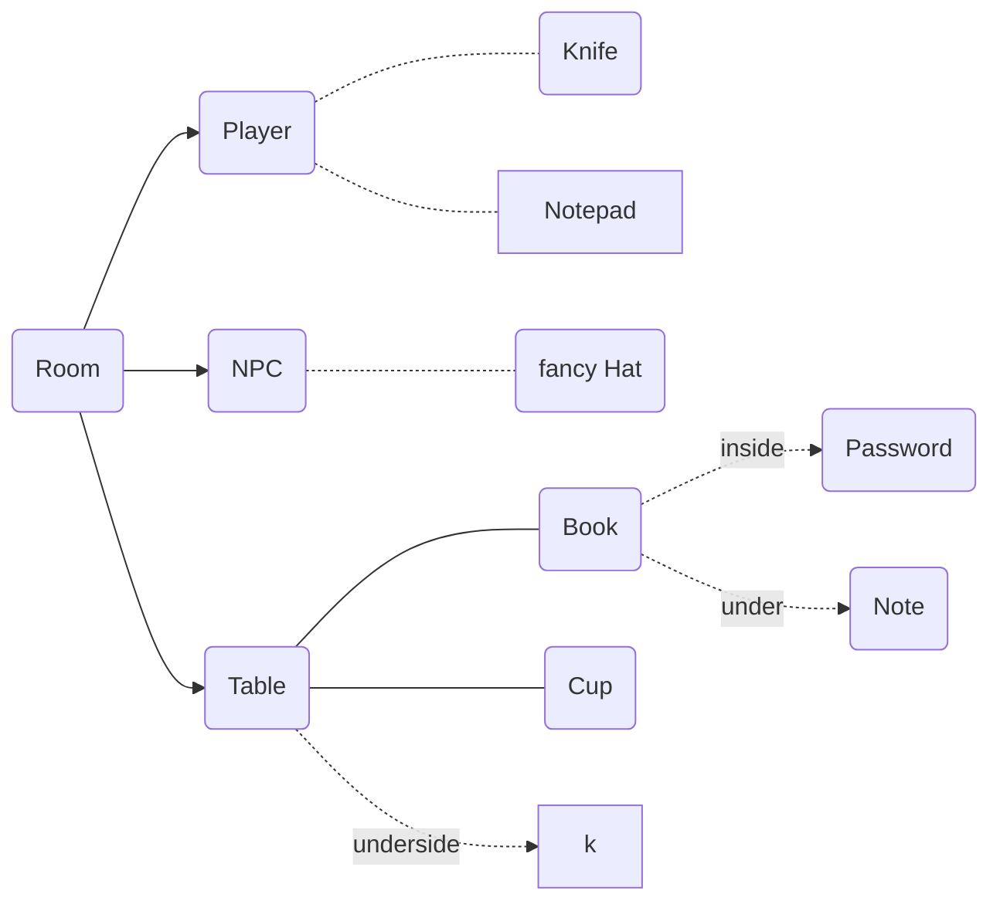
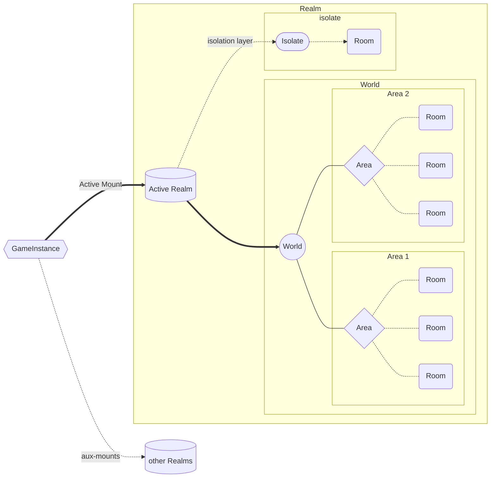

# General Notes on the World-Object/Realms

## Actively Isolate layers from eachother.

This makes ID-Assignments less likely to conflict as each thing from Rooms to
an Object within a container gets a unique address. And addresses can be
assigned by the direct authority independent from the larger scope.

### Analogy to the IPv6

We want every "physical" thing to have a unique address inside every scope.
So each node has to act as a DNS for its subnet.
eg. **ROOT:Realm:World:room:gameObject:content**

sfedse

sefsdf

